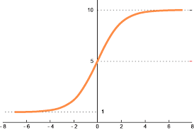

# Neural-Network-from-Scratch

  

In this project, I have hardcoded a neural network to classify handwritten digits from 0 to 9 using the MNIST dataset.

## Libraries I used : 
1. NumPy
2. Pandas
3. Matplotlib

## Important note :
- Tensorflow is not required.
- Keras is not required.

## Pre-requisites :
1. Code-Editor : VSCode, Jupyter NB, Anaconda
2. Command-Line installation (copy) : pip install numpy, pandas, matplotlib

## Layout of the netowrk : 
1. **Input Layer :** Consists of the **'X_train.shape[0]'** neurons which is determined by the number of input features of the input data.
2. **First Hidden Layer :** There are 10 neurons, I have used ReLU (Rectified Linear Unit) as the activation function.
3. **Second Hidden Layer :** Again, there are 10 neurons and I have used ReLU again as an activation fucntion.
4. **Output Layer :** I have used the SoftMax function and hence the number of neurons are dynamically decided by the number of classes in **'Y_train'**.

## Code Explanation : 
**- def init_params() :**
1. We initialised w1 with a random matrix for X_train values using numpy's randn function.
2. Here X_train.shape[0] depicts the number of features present in the training data X_train.
3. np.sqrt(1 / X_train.shape[0]) : This is Xavier initialization to scale randomly generated weights that helps to converge and attain global minimum.
4. b1, b2 : Creating bias vectors (10 rows, 1 column).

**- def ReLU(z) :**
1. **Input** - A Rectified Linear unit can take any form of input that can be a scalar value, a vector or a matrix (typically the result of the linear transformation).
2. **Operation** - If the element is greater than zero i.e (z > 0), the the result remains unchanged, but if the element is less than zero i.e (z < 0), then the result returns zero (0).

  

3. **Function** - ReLU behaves like a linear function for z greater than zero and zero i.e non linear for the values of z less than zero.
4. **Why is it required** - When the negative values are ruled out by zeroing them, the network converges faster and becomes more efficient.
5. **Disadvantages** - For the dataset where negative values are important, the model does not learn from them hence ReLU must be used where only 0 - infinity values are important.

**- def softmax(z) :**
1. **Input** - The softmax function has the input of the linear transformation in a neural network.
2. **Exponentiation np.exp(z - np.max(z))** - Subtracting the **np.max(z)** ensures that the largest value z becomes zero after the subtraction., this helps in the adjustment in reducing the range of exponentiation.
3. **Normalisation exp_z / np.sum(exp_z, axis=0, keepdims=True)** - Computes the sum of the **'exp_z'** along the zeroth axis ensuring that the softmax function value sums up to 1 across the output vector. Finally the normalisation takes place to ensure probabilities ensuring they represent a probability distribution.

  

4. **How it works** - The Softmax function converts the input to a probability distribution where each element in the output vector represents probability of the corresponding class.
5. **Output Range** - The output range is from 0 - 1 making it suitable for multi-class classification tasks.
6. **Usage** - Softmax function is used in backprop.

